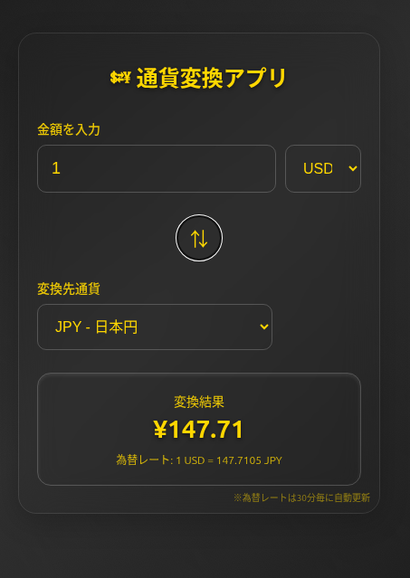

# 通貨変換アプリ



リアルタイムの為替レートで8通貨を相互変換できるWebアプリケーションです。

## 🌐 デモ

[https://vk-4156-5iijde0e8-hiroaki-yoshikuras-projects-7b26a5a1.vercel.app](https://vk-4156-5iijde0e8-hiroaki-yoshikuras-projects-7b26a5a1.vercel.app)

## ✨ 特徴

- **8通貨対応**: USD, EUR, CAD, AUD, GBP, CHF, NZD, JPY
- **リアルタイム為替レート**: ExchangeRate-APIから実際のレートを取得
- **自動更新**: 30分毎に為替レートを自動更新
- **グラスモーフィズムデザイン**: 黒×黄色の洗練されたUI
- **スマホ対応**: レスポンシブデザインで全デバイスに対応
- **オフライン対応**: API接続失敗時もフォールバック値で動作継続

## 🛠 技術スタック

- **Frontend**: HTML5, CSS3, JavaScript (Vanilla)
- **API**: ExchangeRate-API (無料プラン)
- **デザイン**: Glassmorphism UI
- **ホスティング**: Vercel

## 📱 機能

### 通貨変換
- 金額を入力すると即座に変換結果を表示
- 通貨ペアの入れ替えボタン（⇅）
- 現在の為替レート表示

### 対応通貨
- 🇺🇸 USD - 米ドル
- 🇪🇺 EUR - ユーロ
- 🇨🇦 CAD - カナダドル
- 🇦🇺 AUD - 豪ドル
- 🇬🇧 GBP - 英ポンド
- 🇨🇭 CHF - スイスフラン
- 🇳🇿 NZD - ニュージーランドドル
- 🇯🇵 JPY - 日本円

## 🚀 ローカル開発

### 必要環境
- Python 3.x (開発サーバー用)
- Node.js (Vercelデプロイ用)

### セットアップ

```bash
# リポジトリのクローン
git clone [repository-url]
cd currency-converter

# 開発サーバーの起動
python3 -m http.server 8000

# ブラウザでアクセス
# http://localhost:8000
```

### Vercelへのデプロイ

```bash
# Vercel CLIでデプロイ
npx vercel --prod
```

## 📄 ライセンス

MIT License

## 🙏 謝辞

- [ExchangeRate-API](https://www.exchangerate-api.com/) - 無料の為替レートAPI提供
- [Vercel](https://vercel.com/) - ホスティングサービス